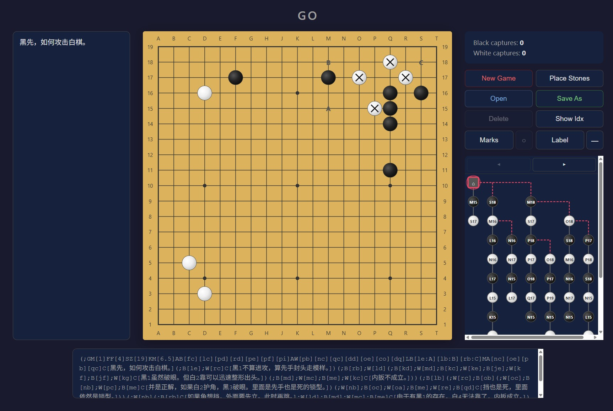

# GoVine

A digital Go notebook — record positions, jot down variations, and annotate the board so nothing you learned in class slips away.



## Quick Start

```bash
npm install
npm run dev
```

Opens at `http://localhost:5173`.

## Features

- **19×19 board** — place stones to recreate any position your teacher shows
- **Full Go rules** — capturing, suicide prohibition, ko rule
- **Branching** — record alternative lines of play the moment your teacher says "or you could try…"
- **Labels** — drop sequential markers (A, B, C…) on the board to follow a lecture sequence
- **Marks** — circle, square, triangle, cross, and more — highlight key shapes and vital points
- **Show Index** — toggle move numbers so you can retrace the exact order
- **Branch diagram** — visual game tree on the right, click to jump between variations
- **Comments** — write notes for any position (left panel), saved inside the SGF file
- **Save As / Open** — everything (branches, marks, labels, comments) saved as standard SGF

## Project Structure

```
src/
├── core/                    # Pure logic — no React
│   ├── types.ts             #   TypeScript types
│   ├── constants.ts         #   Board dimensions, star points, labels
│   ├── gameLogic.ts         #   Go rules engine
│   └── sgf.ts               #   SGF parser & generator
├── state/
│   └── gameReducer.ts       #   Reducer, tree ops, selectors
├── hooks/
│   └── useGame.ts           #   React hook (wires state to UI)
├── components/
│   ├── Board.tsx             #   SVG board
│   ├── Controls.tsx          #   Buttons & capture display
│   └── BranchDiagram.tsx     #   Game tree visualization
├── App.tsx                   #   Root layout
└── main.tsx                  #   Entry point
```

## Scripts

| Command | Description |
|---|---|
| `npm run dev` | Start dev server |
| `npm run build` | Type-check and build for production |
| `npm run preview` | Preview the production build |
